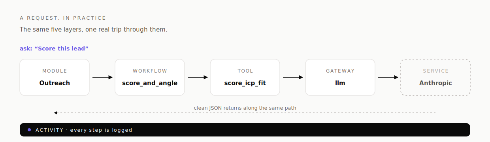
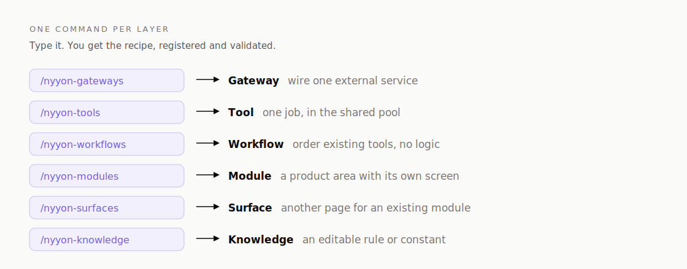

# Nyyon Lite


An installable agent **skill**: a methodology + copy-paste templates for building and
extending a system in five layers.


Each layer reaches only the layer(s) below it. Everything is JSON in / JSON out. Every
meaningful mutation logs to an activity bus. Behavior lives in editable knowledge, not code.

## Why this exists

AI builds best in small pieces. A language model can't hold a whole codebase in its head
at once. Ask it to build a big app in one shot and you get something that works for a
moment but that nobody, human or AI, can safely change later.

This framework fixes that by cutting every build into small, self-contained parts with
fixed edges:

- a **gateway** talks to one outside service
- a **tool** does one job
- a **workflow** runs a few tools in order
- a **module** is one feature with its own screen
- **knowledge** holds the rules, in plain words you can edit

Each part is small enough to build and test on its own. Each part only needs to know about
the parts directly beneath it, never the whole system. So the model can zoom in on one
piece, finish it, prove it works, and move on, without ever loading the entire codebase.

The payoff is a system that stays readable no matter how many times it's edited. You can
follow the chain of gateways, tools, workflows and modules and actually see how the thing
works. It's a little more structure than a seasoned developer needs on their own, and
that's the point: it's built for building **with** AI, where staying legible across a
hundred small edits matters more than being clever in one.

In short: small pieces, fixed edges, one at a time. Boring on purpose, so it never turns
into a mess.

## How a request flows



## What's here

- **`SKILL.md`** — the skill. When to use it, the model, a "which layer do I need" decision
  table, a build recipe per layer, the guardrails, anti-patterns, and a review checklist.
- **`templates/`** — a copy-paste skeleton per component: `gateway.js`, `tool.js`,
  `workflow.js`, `module.index.js`, `module.page.jsx`, `migration.sql`.
- **`commands/`** — one slash command per layer: `/nyyon-gateways`, `/nyyon-tools`,
  `/nyyon-workflows`, `/nyyon-modules`, `/nyyon-knowledge`, plus `/nyyon-surfaces` to add a
  page/view to an existing module. Each runs that layer's recipe, registers the result, and
  validates.



## Install (on any Claude Code / agent)

One command. It installs the skill into `~/.claude/skills/nyyon-lite` and links the
`/nyyon-*` commands. Re-run it any time to update:

```bash
curl -fsSL https://raw.githubusercontent.com/LevNyyon/nyyon-lite/main/install.sh | bash
```

Prefer to see what runs first? Do the same by hand:

```bash
git clone https://github.com/LevNyyon/nyyon-lite.git ~/.claude/skills/nyyon-lite
mkdir -p ~/.claude/commands
ln -sf ~/.claude/skills/nyyon-lite/commands/*.md ~/.claude/commands/
```

The skill auto-triggers on build / extend / wire-a-service / review tasks via its
description; the commands are typed explicitly (`/nyyon-tools summarize`). For a
per-project install, set `NYYON_LITE_DIR=.claude/skills/nyyon-lite` and
`NYYON_LITE_CMDDIR=.claude/commands` before the one-liner.

## Use it

Ask the agent to add a capability. It will: pick the right layer, copy the matching
template, follow the recipe, register the component, check it against the guardrails, and
log the action. Ask it to review, and it walks the checklist and reports violations with
file:line + fix.
